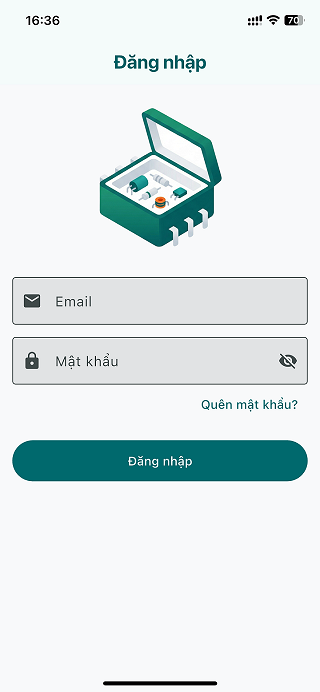
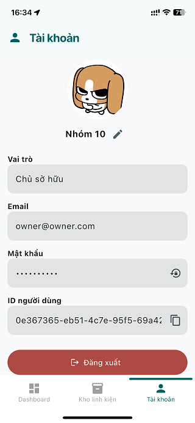
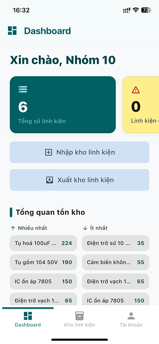
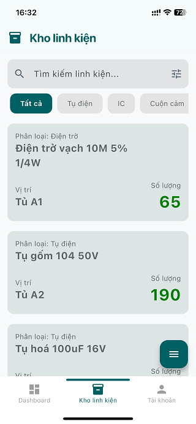

# Component Vault

Ứng dụng di động quản lý kho linh kiện điện tử, xây dựng bằng Flutter với backend Supabase. Hỗ trợ nhập/xuất kho, phân quyền người dùng theo role, và tính năng AI Camera nhận diện giá trị điện trở từ vạch màu.

## Tính năng chính

- **Quản lý kho linh kiện** - Nhập kho, xuất kho, tìm kiếm (hỗ trợ tiếng Việt không dấu), lọc theo danh mục (Điện trở, Tụ điện, IC, Cuộn cảm, Cảm biến)
- **AI Camera** - Chụp ảnh điện trở, gửi lên server phân tích vạch màu bằng YOLOv8, tự động điền giá trị Ohm và sai số vào form
- **Dashboard thống kê** - Tổng quan tồn kho, top linh kiện nhiều/ít nhất, cảnh báo linh kiện sắp hết
- **Phân quyền 3 cấp** - Manager (xem, nhập/xuất), Admin (thêm quản lý tủ/kệ), Owner (quản lý tài khoản và phân quyền)
- **Quản lý tủ/kệ lưu trữ** - CRUD ngăn tủ với thống kê số lượng linh kiện theo vị trí
- **Lịch sử giao dịch** - Xem lại các phiếu nhập/xuất kho theo thời gian

## Cấu trúc dự án

```
electronic_component_storage_app/
├── assets/
│   └── developer/
├── lib/
│   ├── control/
│   ├── model/
│   └── view/
│       ├── auth/
│       ├── dashboard/
│       │   ├── cabinet/
│       │   ├── transaction/
│       │   └── user_management/
│       ├── profile/
│       └── storage/
│           ├── add_component/
│           │   └── confirm/
│           └── export_screen/
├── test/
├── .env
└── pubspec.yaml
```

- **`lib/control/`** - Controller layer: giao tiếp với Supabase (Auth, Database, Storage) và API server nhận diện điện trở
- **`lib/model/`** - Data model: `Component`, `Cabinet`, `MyUser`, `TransactionHeader`
- **`lib/view/auth/`** - Đăng nhập, quên mật khẩu
- **`lib/view/dashboard/`** - Tổng quan, thống kê, quản lý tủ/kệ, lịch sử giao dịch, quản lý nhân sự (Owner)
- **`lib/view/storage/`** - Danh sách kho, nhập kho (tạo mới + chọn có sẵn), xuất kho, AI Camera quét điện trở
- **`lib/view/profile/`** - Hồ sơ cá nhân, đổi mật khẩu, giới thiệu nhóm
- **`assets/developer/`** - Ảnh thành viên nhóm phát triển

## Một vài ảnh chụp màn hình của app





## Tải và cài đặt app
Bạn có thể tải trực tiếp phiên bản mới nhất của **Component Vault** tại [Releases](https://github.com/TVTIT/electronic_component_storage_app/releases/latest).

## Cách build app

### Yêu cầu

- Flutter SDK phiên bản `3.44.8` trở lên
- Android Studio hoặc Xcode
- Tài khoản [Supabase](https://supabase.com/). Nếu chưa có bạn có thể đăng ký
- (Tùy chọn) Server API nhận diện điện trở

### Thiết lập Project Supabase
1. Tạo 1 project mới trên Supabase
2. Truy cập vào phần **SQL Editor** của project
3. Copy toàn bộ code trong file `docs/database_schema.sql` rồi paste vào SQL Editor. Nhấn `Run`, nếu nó hiện cảnh báo thì nhấn `Run query`
4. Truy cập vào phần **Storage** của project. Nhấn **New bucket** để tạo bucket mới
5. Nhập tên `component_icon` và bật `Public bucket` rồi nhấn Create. Làm tương tự để tạo bucket mới với tên `component_image` và `user_avatar`

### Tải source code và cấu hình .env

1. Clone repo:

```bash
git clone https://github.com/your-repo/electronic_component_storage_app.git
cd electronic_component_storage_app
```

2. Tạo file `.env` ở thư mục gốc. Điền URL và Publishable key (Nhấn vào nút **Connect** trong project của bạn):

```
SUPABASE_URL=https://your-project.supabase.co
SUPABASE_PUBLISHABLE_KEY=your_publishable_key
```

3. Cài dependencies:

```bash
flutter pub get
```

### Build

#### Android

> Yêu cầu cài đặt Android Studio theo hướng dẫn trên [Flutter Docs](https://docs.flutter.dev/platform-integration/android/setup)

```bash
# Debug
flutter run

# Release APK
flutter build apk --release

# Release App Bundle (Google Play)
flutter build appbundle --release
```

File output:
- APK: `build/app/outputs/flutter-apk/app-release.apk`
- AAB: `build/app/outputs/bundle/release/app-release.aab`

#### iOS

> Yêu cầu macOS với Xcode đã cài đặt.

```bash
# Debug trên Simulator
flutter run

# Release
flutter build ios --release
```

Mở `ios/Runner.xcworkspace` bằng Xcode để cấu hình signing và archive cho App Store.


## Về dự án này 

Đây là bài tập lớn của sinh viên Trần Vĩnh Trung môn Kỹ thuật phần mềm ứng dụng (ET3260) lớp 169194 của Trường Điện - Điện tử, Đại học Bách khoa Hà Nội học kì 2025.2.

Dự án chắc hẳn còn nhiều thiếu sót. Vì đây là dự án mã nguồn mở nên nếu bạn muốn đóng góp cho dự án này hãy [tạo 1 Pull request](https://github.com/TVTIT/electronic_component_storage_app/pulls) hoặc [tạo 1 Issue](https://github.com/TVTIT/electronic_component_storage_app/issues/new)

## Giấy phép (License) 

Dự án được phân phối dưới giấy phép MIT
